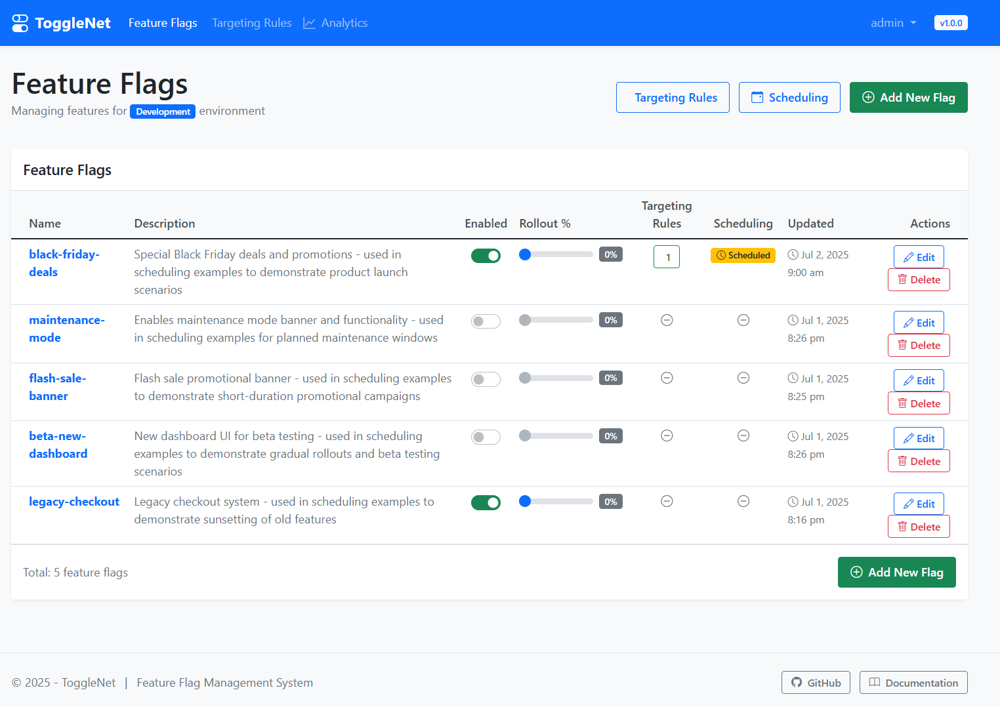
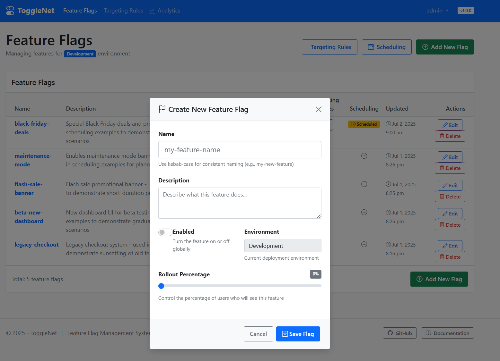
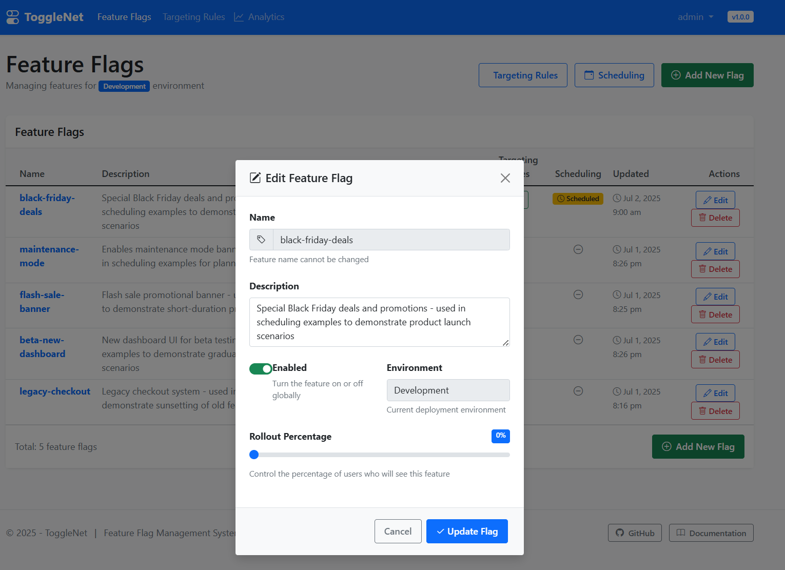
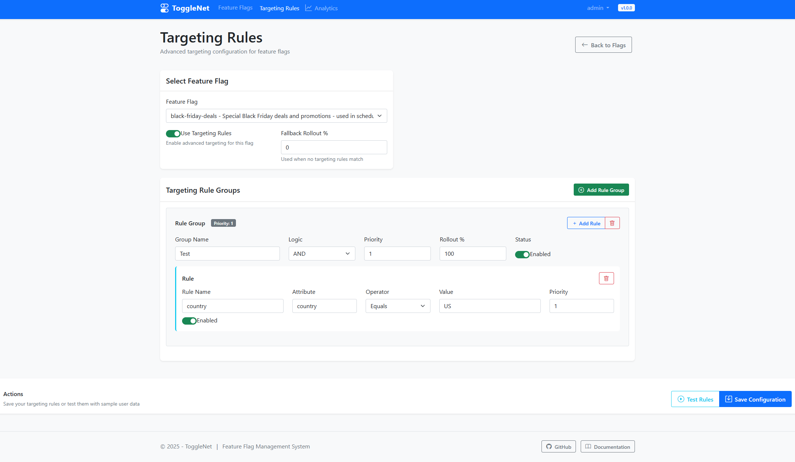
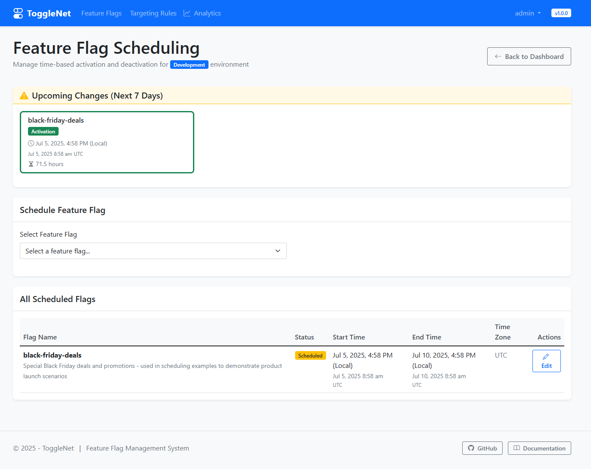
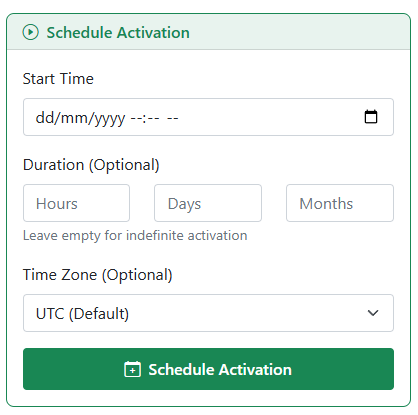
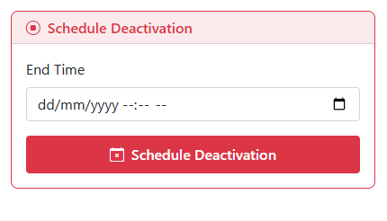
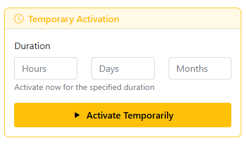
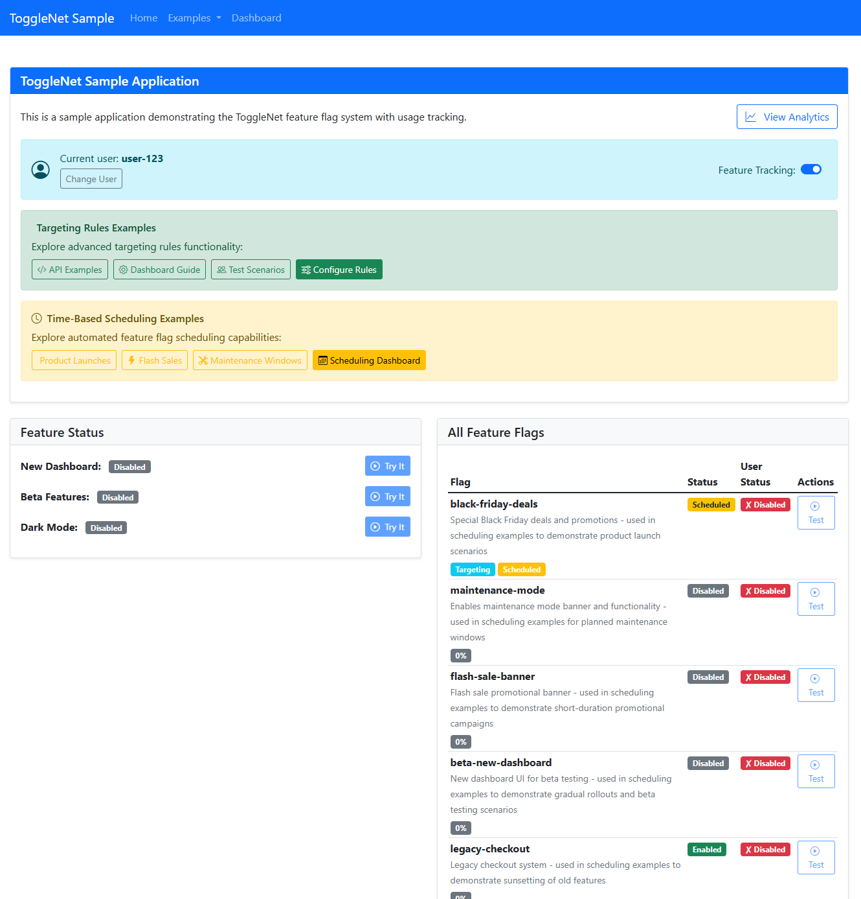
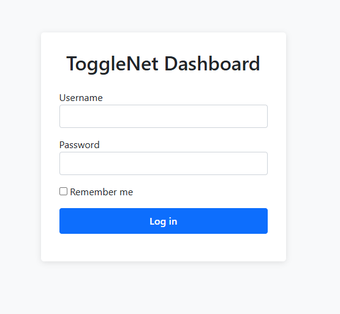

# ToggleNet


A Feature Flag SDK with .NET Standard 2.0 core compatibility. ToggleNet allows .NET applications to manage and evaluate feature flags with persistent storage, percentage rollout support, per-user flag evaluation, and an embedded dashboard.

## Running Tests

To run unit tests locally:

```bash
dotnet test tests/ToggleNet.Core.Tests/ToggleNet.Core.Tests.csproj
```

Tests are also run automatically in CI before NuGet deployment.

## Features

- .NET Standard 2.0 compatible SDK for core functionality
- Persistent storage with EF Core (supports PostgreSQL and SQL Server)
- Percentage-based rollout support
- User-specific feature flag evaluation
- **Advanced Targeting Rules Engine** for sophisticated user targeting
- **Time-Based Scheduling** for automated feature flag activation and deactivation
- Embedded dashboard for managing feature flags (requires .NET 9.0+)
- Secure dashboard access with authentication
- Feature usage analytics and tracking
- Multiple environment support

## Projects

- **ToggleNet.Core**: Core functionality and interfaces
- **ToggleNet.EntityFrameworkCore**: EF Core implementation for PostgreSQL and SQL Server
- **ToggleNet.Dashboard**: ASP.NET Core Razor Pages dashboard

## Getting Started

### Installation

1. Install the NuGet packages:

```bash
dotnet add package ToggleNet.Core
dotnet add package ToggleNet.EntityFrameworkCore
dotnet add package ToggleNet.Dashboard
```

### Configuration

In your `Startup.cs` or `Program.cs` file, add the following:

```csharp
using ToggleNet.Dashboard;
using ToggleNet.Dashboard.Auth;
using ToggleNet.EntityFrameworkCore.Extensions;

// In ConfigureServices method:
// For PostgreSQL:
services.AddEfCoreFeatureStorePostgres(
    Configuration.GetConnectionString("PostgresConnection"),
    "Development");

// OR for SQL Server:
services.AddEfCoreFeatureStoreSqlServer(
    Configuration.GetConnectionString("SqlServerConnection"),
    "Development");

// Add the dashboard with authentication (recommended for production)
services.AddToggleNetDashboard(
    new DashboardUserCredential 
    { 
        Username = "admin", 
        Password = "admin123", 
        DisplayName = "Administrator" 
    },
    new DashboardUserCredential
    {
        Username = "developer",
        Password = "dev123",
        DisplayName = "Developer"
    }
);

// In Configure method:
// Ensure database is created and apply migrations
ToggleNet.EntityFrameworkCore.Extensions.ServiceCollectionExtensions.EnsureFeatureFlagDbCreated(app.ApplicationServices);

// Add the dashboard middleware
app.UseToggleNetDashboard();
```

You can also configure the database provider dynamically:

```csharp
// Get database provider from configuration
string provider = Configuration.GetSection("FeatureFlags:DatabaseProvider").Value ?? "Postgres";
string environment = Configuration.GetSection("FeatureFlags:Environment").Value ?? "Development";

if (provider.Equals("SqlServer", StringComparison.OrdinalIgnoreCase))
{
    services.AddEfCoreFeatureStoreSqlServer(
        Configuration.GetConnectionString("SqlServerConnection"),
        environment);
}
else
{
    // Default to PostgreSQL
    services.AddEfCoreFeatureStorePostgres(
        Configuration.GetConnectionString("PostgresConnection"),
        environment);
}
```

### Using Feature Flags

```csharp
public class HomeController : Controller
{
    private readonly FeatureFlagManager _featureFlagManager;

    public HomeController(FeatureFlagManager featureFlagManager)
    {
        _featureFlagManager = featureFlagManager;
    }

    public async Task<IActionResult> Index()
    {
        // Check if a feature is enabled for a specific user
        bool isFeatureEnabled = await _featureFlagManager.IsEnabledAsync("feature-name", "user-id");
        
        // Get all enabled feature flags for a user
        var enabledFlags = await _featureFlagManager.GetEnabledFlagsForUserAsync("user-id");
        
        // System-wide check (no user context)
        bool isSystemFeatureEnabled = await _featureFlagManager.IsEnabledAsync("system-feature");
        
        return View();
    }
}
```

### Advanced Targeting with User Attributes

ToggleNet includes a powerful targeting rules engine that allows you to target users based on custom attributes, not just percentage rollouts.

```csharp
public class HomeController : Controller
{
    private readonly FeatureFlagManager _featureFlagManager;

    public HomeController(FeatureFlagManager featureFlagManager)
    {
        _featureFlagManager = featureFlagManager;
    }

    public async Task<IActionResult> Index()
    {
        // Create user context with custom attributes
        var userContext = new UserContext
        {
            UserId = "user123",
            Attributes = new Dictionary<string, object>
            {
                ["country"] = "US",
                ["userType"] = "premium",
                ["age"] = 25,
                ["deviceType"] = "mobile",
                ["appVersion"] = "2.1.0",
                ["plan"] = "enterprise"
            }
        };

        // Check feature with targeting rules
        bool isFeatureEnabled = await _featureFlagManager.IsEnabledAsync("advanced-analytics", userContext);
        
        // Or use the simplified overload
        var userAttributes = new Dictionary<string, object>
        {
            ["country"] = "CA",
            ["plan"] = "enterprise"
        };
        bool isEnabled = await _featureFlagManager.IsEnabledAsync("enterprise-features", "user456", userAttributes);
        
        return View();
    }
}
```

#### Targeting Rule Operators

The targeting rules engine supports various operators for sophisticated targeting:

- **String Operations**: `Equals`, `EqualsIgnoreCase`, `NotEquals`, `Contains`, `StartsWith`, `EndsWith`
- **List Operations**: `In`, `NotIn` (supports JSON arrays or comma-separated values)
- **Numeric Operations**: `GreaterThan`, `GreaterThanOrEqual`, `LessThan`, `LessThanOrEqual`
- **Date Operations**: `Before`, `After`
- **Version Operations**: `VersionGreaterThan`, `VersionLessThan` (semantic versioning)
- **Pattern Matching**: `Regex`

#### Rule Groups and Logic

- **Rule Groups**: Combine multiple rules with `AND` or `OR` logic
- **Priority**: Rules and rule groups are evaluated in priority order
- **Fallback**: If no targeting rules match, falls back to percentage rollout
- **Flexible Rollout**: Each rule group can have its own rollout percentage

### Analytics and Usage Tracking

ToggleNet includes built-in feature usage analytics to help you understand how your features are being used.

```csharp
public class HomeController : Controller
{
    private readonly FeatureFlagManager _featureFlagManager;
    
    public HomeController(FeatureFlagManager featureFlagManager)
    {
        _featureFlagManager = featureFlagManager;
    }
    
    public async Task<IActionResult> Index()
    {
        // Usage is automatically tracked when IsEnabledAsync is called with a user ID
        // But you can also track usage explicitly:
        await _featureFlagManager.TrackFeatureUsageAsync("feature-name", "user-id", "Additional context data");
        
        // Enable or disable tracking globally
        _featureFlagManager.EnableTracking(true);
        
        // Check if tracking is currently enabled
        bool isTrackingEnabled = _featureFlagManager.IsTrackingEnabled;
        
        return View();
    }
}
```

The analytics dashboard at `/feature-flags/Analytics` provides insights including:

* Unique user counts for each feature
* Total usage metrics
* Daily usage trends with time-based filtering (7, 30, 90 days)
* Individual feature usage events with user IDs and timestamps
* Ability to enable/disable usage tracking directly from the dashboard

### A/B Testing Support

ToggleNet provides powerful A/B testing capabilities through its targeting rules engine and percentage rollouts:

```csharp
public class CheckoutController : Controller
{
    private readonly FeatureFlagManager _featureFlagManager;

    public async Task<IActionResult> Index()
    {
        var userContext = new UserContext
        {
            UserId = User.Identity.Name,
            Attributes = new Dictionary<string, object>
            {
                ["country"] = GetUserCountry(),
                ["userType"] = GetUserType(),
                ["cartValue"] = GetCartTotal()
            }
        };

        // A/B test: 50% of premium users see new checkout flow
        bool useNewCheckout = await _featureFlagManager.IsEnabledAsync("new-checkout-flow", userContext);
        
        if (useNewCheckout)
        {
            // Track conversion for variant A
            await _featureFlagManager.TrackFeatureUsageAsync("new-checkout-flow", User.Identity.Name, "checkout-started");
            return View("NewCheckout");
        }
        else
        {
            // Track conversion for variant B
            await _featureFlagManager.TrackFeatureUsageAsync("old-checkout-flow", User.Identity.Name, "checkout-started");
            return View("OriginalCheckout");
        }
    }
}
```

**A/B Testing Features:**
- **Percentage-based rollouts** for random user distribution
- **Attribute-based targeting** for specific user segments
- **Multiple variant support** using multiple feature flags
- **Consistent user experience** - same user always sees same variant
- **Built-in analytics** to measure conversion rates and user engagement
- **Gradual rollouts** - start small and increase percentage over time

### Time-Based Scheduling

ToggleNet includes comprehensive time-based scheduling capabilities for automated feature flag management:

```csharp
public class ScheduledFeatureService
{
    private readonly IFeatureFlagScheduler _scheduler;

    public ScheduledFeatureService(IFeatureFlagScheduler scheduler)
    {
        _scheduler = scheduler;
    }

    public async Task ScheduleFeatureLaunch()
    {
        // Schedule activation at a specific time with optional duration
        await _scheduler.ScheduleActivationAsync(
            "new-product-launch", 
            new DateTime(2025, 12, 1, 9, 0, 0), // December 1st, 9:00 AM
            TimeSpan.FromDays(30), // Active for 30 days
            "America/New_York" // Optional timezone
        );

        // Schedule deactivation at a specific time
        await _scheduler.ScheduleDeactivationAsync(
            "maintenance-mode",
            new DateTime(2025, 7, 15, 2, 0, 0) // July 15th, 2:00 AM
        );

        // Schedule temporary activation (starts immediately)
        await _scheduler.ScheduleTemporaryActivationAsync(
            "flash-sale",
            TimeSpan.FromHours(24) // Active for 24 hours
        );

        // Remove scheduling from a feature
        await _scheduler.RemoveSchedulingAsync("temporary-feature");

        // Get upcoming scheduled changes
        var upcomingChanges = await _scheduler.GetUpcomingChangesAsync(168); // Next 7 days
    }
}
```

**Time-Based Scheduling Features:**
- **Scheduled Activation**: Automatically enable features at specific dates and times
- **Scheduled Deactivation**: Automatically disable features at predetermined times
- **Duration-Based Scheduling**: Set features to be active for specific time periods
- **Temporary Activation**: Instantly activate features for a limited duration
- **Timezone Support**: Schedule features in different timezones (UTC, Eastern, Pacific, etc.)
- **Flexible Duration**: Support for hours, days, and months with accurate calendar calculations
- **Dashboard Management**: User-friendly interface for scheduling without code
- **Upcoming Changes View**: See all scheduled feature changes in advance
- **Time Display**: Shows times in both local and UTC formats for clarity

#### Scheduling Dashboard

The scheduling dashboard (`/feature-flags/scheduling`) provides an intuitive interface for managing time-based feature flags:

- **Schedule Activation**: Set start times with optional duration and timezone selection
- **Schedule Deactivation**: Set specific end times for feature flags
- **Temporary Activation**: Quickly activate features for a specified duration starting immediately
- **Visual Scheduling Overview**: See upcoming changes and currently scheduled flags
- **Time Zone Support**: Choose from common timezones or use UTC
- **Flexible Duration Input**: Specify duration in hours, days, and months with accurate calendar math
- **Real-time Time Display**: Shows scheduled times in both local time and UTC
- **Edit Scheduling**: Modify existing schedules directly from the dashboard

#### Scheduling Use Cases

**Product Launches:**
```csharp
// Launch new feature on Black Friday at 12:01 AM EST
await _scheduler.ScheduleActivationAsync(
    "black-friday-deals", 
    new DateTime(2025, 11, 29, 0, 1, 0),
    TimeSpan.FromDays(4), // Active through Cyber Monday
    "America/New_York"
);
```

**Maintenance Windows:**
```csharp
// Activate maintenance mode for 2 hours starting at 2 AM
await _scheduler.ScheduleActivationAsync(
    "maintenance-mode",
    new DateTime(2025, 7, 15, 2, 0, 0),
    TimeSpan.FromHours(2)
);
```

**Flash Sales:**
```csharp
// Start flash sale immediately for 6 hours
await _scheduler.ScheduleTemporaryActivationAsync(
    "flash-sale-banner",
    TimeSpan.FromHours(6)
);
```

**Regional Rollouts:**
```csharp
// Launch feature in different timezones
await _scheduler.ScheduleActivationAsync("new-feature", 
    new DateTime(2025, 8, 1, 9, 0, 0), null, "America/Los_Angeles");
await _scheduler.ScheduleActivationAsync("new-feature", 
    new DateTime(2025, 8, 1, 9, 0, 0), null, "America/New_York");
```

## Custom Feature Store

You can implement your own feature store by implementing the `IFeatureStore` interface:

```csharp
public class MyCustomFeatureStore : IFeatureStore
{
    // Implement interface methods
}

// Register in DI
services.AddFeatureFlagServices<MyCustomFeatureStore>("Development");
```

## Visual Guide

Get a comprehensive overview of ToggleNet's dashboard and features through these screenshots:

### Dashboard Overview


*Main dashboard showing all feature flags with their current status, rollout percentages, and scheduling information*

### Creating a Feature Flag


*Simple form to create a new feature flag with name, description, and initial settings*

### Feature Flag Settings


*Detailed view of a feature flag showing enabled/disabled state, rollout percentage, and quick actions*

### Targeting Rules Configuration


*Advanced targeting rules interface with attribute-based conditions, operators, and rule groups*

### Time-Based Scheduling


*Scheduling panel for automated feature flag activation/deactivation with timezone support*

### Schedule Activation


*Form to schedule a feature flag activation with start time, duration, and timezone selection*

### Schedule Deactivation


*Interface to schedule automatic feature flag deactivation at a specific time*

### Temporary Activation


*Quick temporary activation with predefined duration options (1 hour, 1 day, 1 week, etc.)*

### User-Specific Dashboard


*Personalized view showing feature flag status for a specific user based on targeting rules*

### Authentication


*Secure login interface for dashboard access with configurable user credentials*

## Dashboard

The dashboard is accessible at `/feature-flags` by default. You can customize the path:

```csharp
app.UseToggleNetDashboard("/my-feature-flags");
```

The dashboard provides multiple pages:
* **Dashboard Home**: Manage and configure feature flags
* **Targeting Rules**: Advanced configuration interface for targeting rules
  * Form-based rule builder interface for creating targeting rules
  * Real-time rule testing with sample user data and detailed evaluation results
  * Support for complex rule groups with AND/OR logic
  * Priority-based rule ordering with numeric values
  * Per-rule group rollout percentages
  * Contextual notifications for save operations and errors
  * Test results history with chronological display
* **Scheduling**: Time-based feature flag management and automation
  * Schedule feature activation with optional duration and timezone support
  * Schedule feature deactivation at specific times
  * Temporary activation for immediate, time-limited feature enabling
  * Visual upcoming changes overview showing all scheduled modifications
  * All scheduled flags table with status indicators and time displays
  * Intuitive duration input with support for hours, days, and months
  * Accurate calendar-based month calculations for precise scheduling
  * Local time and UTC display for clear time zone handling
* **Analytics**: View usage statistics, trends, and individual usage events
  * Filter by time period (7, 30, or 90 days)
  * View unique user counts and total usage metrics
  * Enable/disable tracking directly from the interface
  * See detailed usage events with user IDs and timestamps
  
### Dashboard Authentication

The dashboard includes built-in authentication for security:

```csharp
// Add authentication with predefined users
services.AddToggleNetDashboard(
    new DashboardUserCredential 
    { 
        Username = "admin", 
        Password = "strongpassword", 
        DisplayName = "Administrator" 
    },
    // Add as many users as needed
    new DashboardUserCredential 
    { 
        Username = "developer", 
        Password = "devpassword",
        DisplayName = "Developer User"
    }
);
```

**Important:** The dashboard requires authentication by default. Always use strong passwords in production environments.

## Sample Application

Check out the `samples/SampleWebApp` project for a complete example of how to use ToggleNet in an ASP.NET Core application.

### Targeting Rules Examples

The sample application includes a `TargetingExampleController` that demonstrates various targeting scenarios:

- **Basic targeting** with simple user attributes
- **Complex targeting** with multiple user attributes and business logic
- **Mobile-specific features** based on device type and OS version
- **Beta testing programs** with version-specific targeting
- **Regional compliance** features based on geographic location

## Recent Updates - Targeting Rules Engine & Time-Based Scheduling

ToggleNet now includes two powerful new capabilities that significantly enhance feature flag management:

### 🎯 Targeting Rules Engine

A sophisticated **Targeting Rules Engine** that provides advanced user targeting capabilities beyond simple percentage rollouts:

#### Key Features Added:
- **User Context System**: Rich user attribute support for targeting decisions
- **Flexible Rule Operations**: 15+ operators including string, numeric, date, and version comparisons
- **Rule Groups**: Combine multiple rules with AND/OR logic
- **Priority-based Evaluation**: Control rule evaluation order with priorities
- **Per-Rule Rollouts**: Each rule group can have its own rollout percentage
- **Database Support**: Full Entity Framework Core integration
- **Backward Compatibility**: Existing percentage-based flags continue to work

### ⏰ Time-Based Scheduling

Comprehensive **Time-Based Scheduling** system for automated feature flag lifecycle management:

#### Key Features Added:
- **Scheduled Activation**: Automatically enable features at specific dates and times
- **Scheduled Deactivation**: Automatically disable features at predetermined times
- **Duration-Based Scheduling**: Set features to be active for specific time periods
- **Temporary Activation**: Instantly activate features for a limited duration
- **Timezone Support**: Schedule features in different timezones with accurate conversion
- **Calendar-Accurate Duration**: Precise month/day/hour calculations respecting calendar boundaries
- **Dashboard Integration**: User-friendly scheduling interface with visual upcoming changes
- **Flexible Time Display**: Shows times in both local and UTC formats for clarity

### Quick Start with New Features:

#### Targeting Rules:
```csharp
// Create user context with targeting attributes
var userContext = new UserContext
{
    UserId = "user123",
    Attributes = new Dictionary<string, object>
    {
        ["country"] = "US",
        ["plan"] = "enterprise",
        ["appVersion"] = "2.1.0"
    }
};

// Check feature with targeting rules
bool isEnabled = await _featureFlagManager.IsEnabledAsync("premium-features", userContext);
```

#### Time-Based Scheduling:
```csharp
// Schedule feature for Black Friday launch
await _scheduler.ScheduleActivationAsync(
    "black-friday-deals", 
    new DateTime(2025, 11, 29, 0, 1, 0),
    TimeSpan.FromDays(4), // Active through Cyber Monday
    "America/New_York"
);

// Temporary flash sale starting now
await _scheduler.ScheduleTemporaryActivationAsync(
    "flash-sale",
    TimeSpan.FromHours(6)
);
```

### Targeting Rules Dashboard:

The new Targeting Rules dashboard (`/feature-flags/targeting-rules`) provides a user-friendly interface for configuring complex targeting scenarios:

- **Form-based Rule Builder**: Intuitive interface for creating targeting rules without code
- **Rule Groups**: Organize related rules and set logical operators (AND/OR)
- **Live Testing**: Test your targeting rules with sample user data before deployment
- **Rule Priorities**: Control evaluation order with numeric priority values
- **Flexible Rollouts**: Set different rollout percentages for each rule group
- **Common Attributes**: Pre-populated suggestions for common user attributes like country, plan, device type, etc.
- **Real-time Notifications**: Immediate feedback for save operations and test results
- **Detailed Test Results**: Comprehensive evaluation details showing which rules matched and why

### Scheduling Dashboard:

The new Scheduling dashboard (`/feature-flags/scheduling`) provides comprehensive time-based feature flag management:

- **Visual Timeline**: See upcoming scheduled changes at a glance
- **Flexible Scheduling Options**: Activation, deactivation, and temporary activation modes
- **Timezone Support**: Choose from common timezones or use UTC with automatic conversion
- **Duration Builder**: Intuitive interface for setting hours, days, and months
- **Calendar Accuracy**: Precise month calculations that respect actual calendar boundaries
- **Real-time Preview**: See exactly when features will activate/deactivate in your local time
- **Bulk Management**: View and manage all scheduled flags in one place
- **Status Indicators**: Visual status badges showing active, scheduled, and inactive states

### Targeting Rules Logic:

The targeting rules engine follows a strict evaluation logic:

1. **When targeting rules are disabled**: Uses the fallback rollout percentage
2. **When targeting rules are enabled**:
   - Evaluates rule groups in priority order (lowest priority first)
   - **If a rule group matches**: Uses that group's rollout percentage
   - **If NO rule groups match**: Feature is **disabled** (regardless of fallback percentage)

This ensures that targeting rules are strictly enforced - users must meet the defined criteria to receive features.

Example targeting scenarios you can configure through the dashboard:
- **Premium Features**: Target users with `plan = "enterprise"` AND `country IN ["US", "CA"]`
- **Beta Features**: Target users with `betaTester = true` OR `appVersion >= "2.0.0"`
- **Regional Features**: Target users with `country = "US"` with 50% rollout
- **Device-Specific**: Target users with `deviceType = "mobile"` AND `osVersion >= "iOS 15"`

This implementation provides enterprise-grade feature flag management with the flexibility to target users based on any combination of attributes while maintaining high performance and reliability.

## Database Setup

**No manual migration required!**

ToggleNet automatically applies any pending database migrations and ensures the required tables are created at application startup. You do not need to run `dotnet ef database update` or manage migrations manually.

## Security

The ToggleNet dashboard is protected by authentication to prevent unauthorized access to feature flag management. Authentication is **enabled by default** and cannot be disabled in production scenarios.

For production environments:
- Always use strong, unique passwords for dashboard users
- Consider implementing custom authentication providers for integration with your existing user management systems
- The dashboard uses secure cookie-based authentication with configurable timeouts

## License

MIT
